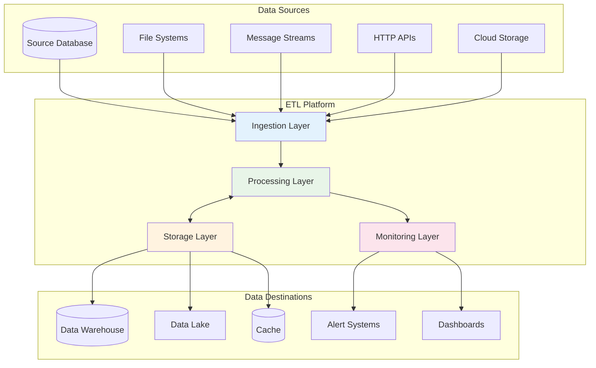
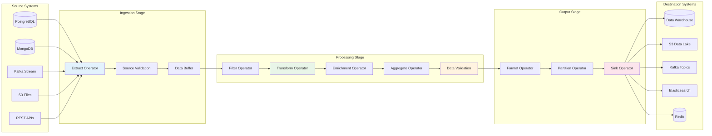
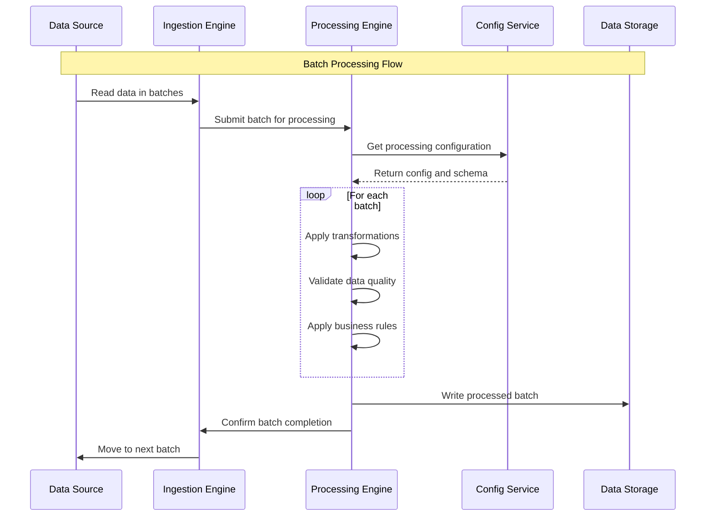
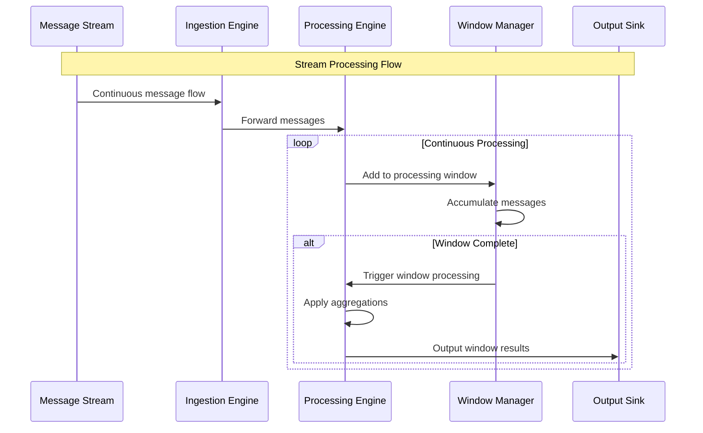
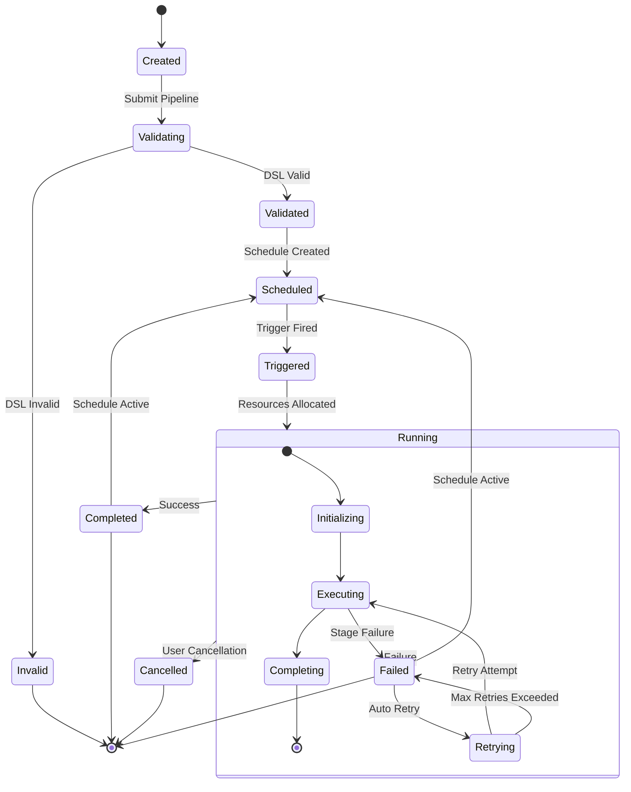

# Data Flow Architecture

## Overview

## Pipeline Data Flow

### End-to-End Pipeline Execution

### Data Processing Patterns

#### Batch Processing Flow

#### Stream Processing Flow

## Control Flow

### Pipeline Lifecycle Management

