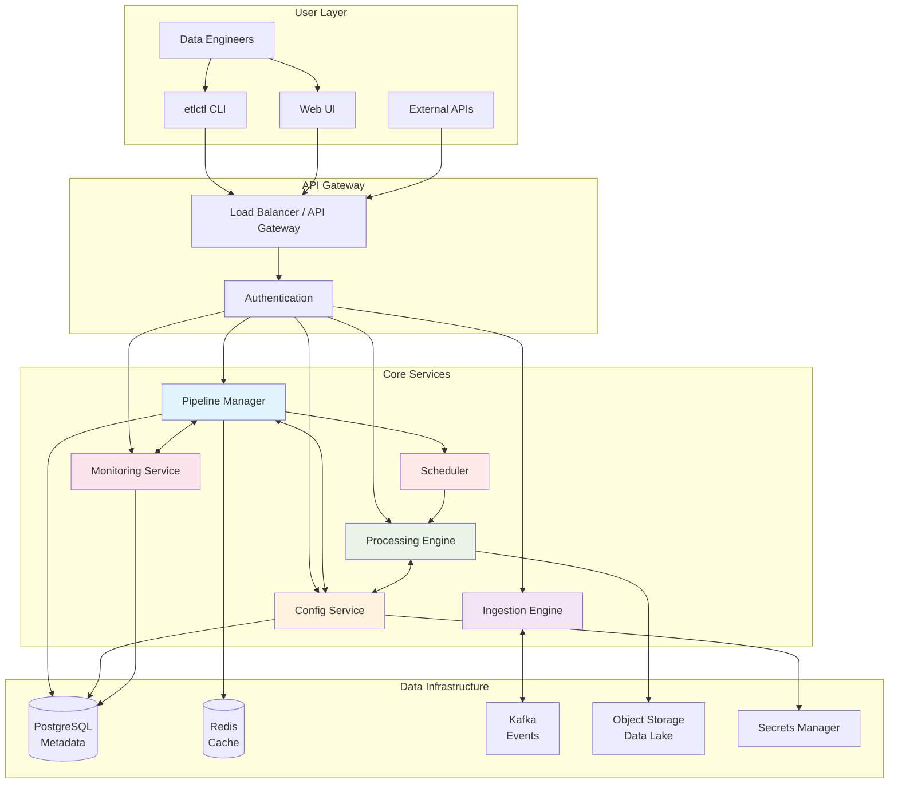

# Architecture Overview

This document provides a high-level overview of the ETL Platform architecture, covering system design.

## System Architecture

```mermaid
graph TB
    subgraph "User Layer"
        USER[Data Engineers]
        CLI[etlctl CLI]
        WEB[Web UI]
        API[External APIs]
    end

    subgraph "API Gateway"
        GW[Load Balancer / API Gateway]
        AUTH[Authentication]
    end

    subgraph "Core Services"
        PM[Pipeline Manager]
        PE[Processing Engine]
        CS[Config Service]
        MS[Monitoring Service]
        IE[Ingestion Engine]
        SH[Scheduler]
    end

    subgraph "Data Infrastructure"
        DB[(PostgreSQL<br/>Metadata)]
        CACHE[(Redis<br/>Cache)]
        MQ[Kafka<br/>Events]
        S3[Object Storage<br/>Data Lake]
        VAULT[Secrets Manager]
    end

    USER --> CLI
    USER --> WEB
    CLI --> GW
    WEB --> GW
    API --> GW

    GW --> AUTH
    AUTH --> PM
    AUTH --> PE
    AUTH --> CS
    AUTH --> MS
    AUTH --> IE
    
    PM --> SH
    SH --> PE
    PM <--> CS
    PM <--> MS
    PE <--> CS
    IE <--> MQ

    PM --> DB
    CS --> DB
    MS --> DB
    PM --> CACHE
    CS --> VAULT
    PE --> S3

    style PM fill:#e1f5fe
    style PE fill:#e8f5e8
    style CS fill:#fff3e0
    style MS fill:#fce4ec
    style IE fill:#f3e5f5
    style SH fill:#FEEBE7
```
