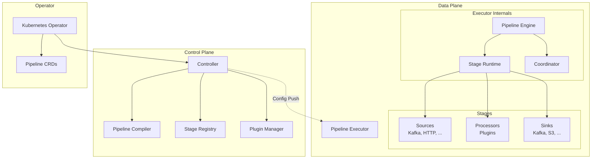
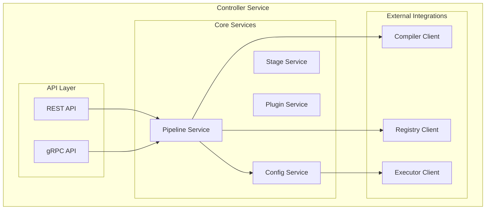
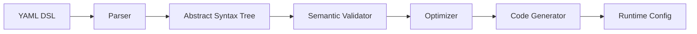

# YeTi Components - Detailed Specification v2

## Обзор

Платформа YeTi построена на модульной архитектуре с чётким разделением Control Plane и Data Plane. Все компоненты спроектированы для работы в Kubernetes и обеспечивают высокую доступность, производительность и расширяемость.

## Архитектура компонентов



---

## Control Plane Components

## 1. YeTi Controller (Go)

### Описание
Центральный управляющий сервис, координирующий всю платформу.

### Архитектура



### Ключевые модули

#### 1.1 Pipeline Service

```go
// controlplane/controller/internal/service/pipeline.go
type PipelineService interface {
    // CRUD операции
    Create(ctx context.Context, spec *PipelineSpec) (*Pipeline, error)
    Get(ctx context.Context, id string) (*Pipeline, error)
    List(ctx context.Context, filters Filters) ([]*Pipeline, error)
    Update(ctx context.Context, id string, spec *PipelineSpec) error
    Delete(ctx context.Context, id string) error
    
    // Lifecycle operations
    Deploy(ctx context.Context, id string) error
    Pause(ctx context.Context, id string) error
    Resume(ctx context.Context, id string) error
    
    // Status operations
    GetStatus(ctx context.Context, id string) (*PipelineStatus, error)
    GetMetrics(ctx context.Context, id string) (*Metrics, error)
}

type PipelineServiceImpl struct {
    compiler   CompilerClient
    registry   RegistryClient
    repository PipelineRepository
    executor   ExecutorClient
    validator  Validator
}

func (s *PipelineServiceImpl) Create(ctx context.Context, spec *PipelineSpec) (*Pipeline, error) {
    // 1. Validate spec
    if err := s.validator.Validate(spec); err != nil {
        return nil, err
    }
    
    // 2. Compile pipeline
    compiled, err := s.compiler.Compile(ctx, spec)
    if err != nil {
        return nil, err
    }
    
    // 3. Validate stages against registry
    if err := s.registry.ValidateStages(compiled.Stages); err != nil {
        return nil, err
    }
    
    // 4. Save to database
    pipeline := &Pipeline{
        ID:       uuid.New().String(),
        Spec:     spec,
        Compiled: compiled,
        Status:   StatusPending,
    }
    
    if err := s.repository.Create(ctx, pipeline); err != nil {
        return nil, err
    }
    
    return pipeline, nil
}
```

#### 1.2 Config Distribution Service

```go
// controlplane/controller/internal/service/config.go
type ConfigService interface {
    // Push config to executors
    PushConfig(ctx context.Context, pipelineID string, executors []string) error
    
    // Watch for executor registrations
    WatchExecutors(ctx context.Context) (<-chan ExecutorEvent, error)
    
    // Get executor health
    GetExecutorHealth(ctx context.Context, executorID string) (*Health, error)
}

type ConfigServiceImpl struct {
    executorClients map[string]ExecutorClient
    mu              sync.RWMutex
}

func (s *ConfigServiceImpl) PushConfig(ctx context.Context, pipelineID string, executors []string) error {
    // Get compiled config
    pipeline, err := s.repository.Get(ctx, pipelineID)
    if err != nil {
        return err
    }
    
    config := pipeline.Compiled
    
    // Push to all executors concurrently
    var wg sync.WaitGroup
    errChan := make(chan error, len(executors))
    
    for _, executorID := range executors {
        wg.Add(1)
        go func(execID string) {
            defer wg.Done()
            
            client := s.getExecutorClient(execID)
            if client == nil {
                errChan <- fmt.Errorf("executor %s not found", execID)
                return
            }
            
            // Push config via gRPC
            if err := client.UpdateConfig(ctx, config); err != nil {
                errChan <- err
                return
            }
            
            // Wait for ACK (with timeout)
            if err := client.WaitForAck(ctx, 30*time.Second); err != nil {
                errChan <- err
            }
        }(executorID)
    }
    
    wg.Wait()
    close(errChan)
    
    // Check for errors
    for err := range errChan {
        if err != nil {
            return err
        }
    }
    
    return nil
}
```

### REST API

```go
// controlplane/controller/internal/api/rest/routes.go
func RegisterRoutes(r *gin.Engine, svc *Services) {
    api := r.Group("/api/v1")
    
    // Pipeline management
    pipelines := api.Group("/pipelines")
    {
        pipelines.POST("", CreatePipeline(svc.Pipeline))
        pipelines.GET("", ListPipelines(svc.Pipeline))
        pipelines.GET("/:id", GetPipeline(svc.Pipeline))
        pipelines.PUT("/:id", UpdatePipeline(svc.Pipeline))
        pipelines.DELETE("/:id", DeletePipeline(svc.Pipeline))
        
        // Lifecycle
        pipelines.POST("/:id/deploy", DeployPipeline(svc.Pipeline))
        pipelines.POST("/:id/pause", PausePipeline(svc.Pipeline))
        pipelines.POST("/:id/resume", ResumePipeline(svc.Pipeline))
        
        // Status & Metrics
        pipelines.GET("/:id/status", GetPipelineStatus(svc.Pipeline))
        pipelines.GET("/:id/metrics", GetPipelineMetrics(svc.Pipeline))
    }
    
    // Stage management
    stages := api.Group("/stages")
    {
        stages.GET("", ListStageTypes(svc.Registry))
        stages.GET("/:type", GetStageType(svc.Registry))
        stages.GET("/:type/schema", GetStageSchema(svc.Registry))
    }
    
    // Plugin management
    plugins := api.Group("/plugins")
    {
        plugins.GET("", ListPlugins(svc.Plugin))
        plugins.POST("/install", InstallPlugin(svc.Plugin))
        plugins.DELETE("/:name", UninstallPlugin(svc.Plugin))
        plugins.GET("/:name/versions", GetPluginVersions(svc.Plugin))
    }
}
```

---

## 2. Pipeline Compiler

### Описание
Компилирует YAML DSL в оптимизированную исполняемую конфигурацию.

### Архитектура компилятора



### Компоненты компилятора

#### 2.1 Parser

```go
// controlplane/compiler/internal/parser/parser.go
type Parser struct {
    registry RegistryClient
}

func (p *Parser) Parse(yamlContent []byte) (*AST, error) {
    var raw RawPipeline
    if err := yaml.Unmarshal(yamlContent, &raw); err != nil {
        return nil, fmt.Errorf("invalid YAML: %w", err)
    }
    
    ast := &AST{
        Version: raw.APIVersion,
        Kind:    raw.Kind,
        Metadata: raw.Metadata,
    }
    
    // Parse source
    sourceNode, err := p.parseSource(raw.Spec.Source)
    if err != nil {
        return nil, err
    }
    ast.Source = sourceNode
    
    // Parse stages
    for _, stageSpec := range raw.Spec.Stages {
        stageNode, err := p.parseStage(stageSpec)
        if err != nil {
            return nil, err
        }
        ast.Stages = append(ast.Stages, stageNode)
    }
    
    // Parse sink
    sinkNode, err := p.parseSink(raw.Spec.Sink)
    if err != nil {
        return nil, err
    }
    ast.Sink = sinkNode
    
    return ast, nil
}
```

#### 2.2 Validator

```go
// controlplane/compiler/internal/validator/validator.go
type Validator struct {
    registry RegistryClient
}

func (v *Validator) Validate(ast *AST) error {
    // 1. Validate source stage exists in registry
    if !v.registry.HasStageType(ast.Source.Type) {
        return fmt.Errorf("unknown source type: %s", ast.Source.Type)
    }
    
    // 2. Validate each processor stage
    for _, stage := range ast.Stages {
        if err := v.validateStage(stage); err != nil {
            return err
        }
    }
    
    // 3. Validate sink
    if !v.registry.HasStageType(ast.Sink.Type) {
        return fmt.Errorf("unknown sink type: %s", ast.Sink.Type)
    }
    
    // 4. Validate data flow
    if err := v.validateDataFlow(ast); err != nil {
        return err
    }
    
    return nil
}

func (v *Validator) validateStage(stage *StageNode) error {
    // Check stage type exists
    stageType, err := v.registry.GetStageType(stage.Type)
    if err != nil {
        return err
    }
    
    // For processor stages, validate plugins
    if stage.Type == "processor" {
        for _, plugin := range stage.Plugins {
            if !v.registry.HasPlugin(plugin) {
                return fmt.Errorf("unknown plugin: %s", plugin)
            }
        }
    }
    
    // Validate config against schema
    if err := v.validateConfig(stage.Config, stageType.Schema); err != nil {
        return err
    }
    
    return nil
}
```

#### 2.3 Optimizer

```go
// controlplane/compiler/internal/optimizer/optimizer.go
type Optimizer struct {
    passes []OptimizationPass
}

type OptimizationPass interface {
    Name() string
    Optimize(*AST) (*AST, error)
}

// Stage Fusion Pass: объединяет совместимые stages
type StageFusionPass struct{}

func (p *StageFusionPass) Optimize(ast *AST) (*AST, error) {
    var optimized []*StageNode
    var currentBatch []*StageNode
    
    for _, stage := range ast.Stages {
        // Если stage — processor с thread isolation
        if stage.Type == "processor" && stage.Isolation == "thread" {
            currentBatch = append(currentBatch, stage)
        } else {
            // Flush current batch
            if len(currentBatch) > 0 {
                fused := p.fuseStages(currentBatch)
                optimized = append(optimized, fused)
                currentBatch = nil
            }
            optimized = append(optimized, stage)
        }
    }
    
    // Flush remaining
    if len(currentBatch) > 0 {
        fused := p.fuseStages(currentBatch)
        optimized = append(optimized, fused)
    }
    
    ast.Stages = optimized
    return ast, nil
}

func (p *StageFusionPass) fuseStages(stages []*StageNode) *StageNode {
    // Combine all plugins into one stage
    var allPlugins []string
    for _, stage := range stages {
        allPlugins = append(allPlugins, stage.Plugins...)
    }
    
    return &StageNode{
        Name:      "fused-processor",
        Type:      "processor",
        Plugins:   allPlugins,
        Isolation: "thread",
    }
}

// Dead Code Elimination Pass
type DeadCodeEliminationPass struct{}

func (p *DeadCodeEliminationPass) Optimize(ast *AST) (*AST, error) {
    // Analyze which stages are reachable
    reachable := p.analyzeReachability(ast)
    
    // Remove unreachable stages
    var optimized []*StageNode
    for _, stage := range ast.Stages {
        if reachable[stage.Name] {
            optimized = append(optimized, stage)
        }
    }
    
    ast.Stages = optimized
    return ast, nil
}
```

#### 2.4 Code Generator

```go
// controlplane/compiler/internal/codegen/codegen.go
type CodeGenerator struct{}

func (g *CodeGenerator) Generate(ast *AST) (*RuntimeConfig, error) {
    config := &RuntimeConfig{
        PipelineID: ast.Metadata.Name,
        Version:    1,
    }
    
    // Generate source config
    config.Source = g.generateStageConfig(ast.Source)
    
    // Generate stage configs
    for i, stage := range ast.Stages {
        stageConfig := g.generateStageConfig(stage)
        stageConfig.Order = i
        config.Stages = append(config.Stages, stageConfig)
    }
    
    // Generate sink config
    config.Sink = g.generateStageConfig(ast.Sink)
    
    // Generate transport configs
    config.Transport = g.generateTransportConfig(ast)
    
    return config, nil
}

type RuntimeConfig struct {
    PipelineID string                `json:"pipeline_id"`
    Version    int                   `json:"version"`
    Source     *StageConfig          `json:"source"`
    Stages     []*StageConfig        `json:"stages"`
    Sink       *StageConfig          `json:"sink"`
    Transport  *TransportConfig      `json:"transport"`
}

type StageConfig struct {
    ID        string                 `json:"id"`
    Name      string                 `json:"name"`
    Type      string                 `json:"type"`
    Order     int                    `json:"order"`
    Plugins   []string               `json:"plugins,omitempty"`
    Isolation string                 `json:"isolation,omitempty"`
    Config    map[string]interface{} `json:"config"`
}
```

---

## 3. Stage & Plugin Registry

### Описание
Централизованный каталог всех доступных stage types и plugins.

### Архитектура

```go
// controlplane/registry/internal/service/registry.go
type RegistryService struct {
    store      Store
    validator  SchemaValidator
    versioning VersionManager
}

type StageType struct {
    Name        string              `json:"name"`
    Version     string              `json:"version"`
    Category    string              `json:"category"` // source, processor, sink
    Description string              `json:"description"`
    Schema      *jsonschema.Schema  `json:"schema"`
    Metadata    map[string]string   `json:"metadata"`
}

type Plugin struct {
    Name         string             `json:"name"`
    Version      string             `json:"version"`
    Category     string             `json:"category"` // filter, map, enrich, etc.
    Description  string             `json:"description"`
    Author       string             `json:"author"`
    License      string             `json:"license"`
    Schema       *jsonschema.Schema `json:"schema"`
    Dependencies []string           `json:"dependencies"`
    Binary       *BinaryInfo        `json:"binary"`
}

func (s *RegistryService) RegisterStageType(stageType *StageType) error {
    // Validate schema
    if err := s.validator.ValidateSchema(stageType.Schema); err != nil {
        return err
    }
    
    // Store in database
    return s.store.SaveStageType(stageType)
}

func (s *RegistryService) RegisterPlugin(plugin *Plugin) error {
    // Validate plugin
    if err := s.validatePlugin(plugin); err != nil {
        return err
    }
    
    // Check dependencies
    if err := s.checkDependencies(plugin.Dependencies); err != nil {
        return err
    }
    
    // Store plugin metadata
    return s.store.SavePlugin(plugin)
}

func (s *RegistryService) GetStageType(name string, version string) (*StageType, error) {
    if version == "" {
        version = "latest"
    }
    return s.store.GetStageType(name, version)
}

func (s *RegistryService) ListPlugins(filters map[string]string) ([]*Plugin, error) {
    return s.store.QueryPlugins(filters)
}
```

### Schema для stages

```json
{
  "name": "kafka-source",
  "version": "1.0.0",
  "category": "source",
  "schema": {
    "type": "object",
    "required": ["bootstrap_servers", "topics"],
    "properties": {
      "bootstrap_servers": {
        "type": "string",
        "description": "Kafka bootstrap servers"
      },
      "topics": {
        "type": "array",
        "items": {"type": "string"},
        "description": "Topics to consume from"
      },
      "consumer_group": {
        "type": "string",
        "default": "yeti-consumer"
      }
    }
  }
}
```

---

## Data Plane Components

## 4. Pipeline Executor (C++)

### Описание
Высокопроизводительный движок выполнения пайплайнов, написанный на C++20.

### Архитектура

```cpp
// dataplane/executor/engine/pipeline_engine.h
namespace yeti::executor {

class PipelineEngine {
public:
    PipelineEngine(const Config& config);
    ~PipelineEngine();
    
    // Lifecycle
    Status Initialize();
    Status Start();
    Status Stop();
    Status Shutdown();
    
    // Configuration
    Status LoadPipeline(const RuntimeConfig& config);
    Status UpdateConfig(const RuntimeConfig& config);
    
    // Processing
    Status ProcessEvent(const Event& event);
    
    // Status
    PipelineStatus GetStatus() const;
    Metrics GetMetrics() const;

private:
    std::unique_ptr<StageRuntime> runtime_;
    std::unique_ptr<Coordinator> coordinator_;
    std::unique_ptr<TransportManager> transport_;
    
    // Stages
    std::unique_ptr<SourceStage> source_;
    std::vector<std::unique_ptr<ProcessorStage>> processors_;
    std::unique_ptr<SinkStage> sink_;
    
    // Threading
    std::vector<std::thread> worker_threads_;
    std::atomic<bool> running_{false};
    
    // Metrics
    std::unique_ptr<MetricsCollector> metrics_;
    std::unique_ptr<TracingManager> tracing_;
};

} // namespace yeti::executor
```

### Stage Runtime

```cpp
// dataplane/executor/runtime/stage_runtime.h
namespace yeti::executor {

class StageRuntime {
public:
    // Load and initialize a stage
    Status LoadStage(const StageConfig& config, 
                     std::unique_ptr<Stage>& stage);
    
    // Execute stage
    Status Execute(Stage* stage, 
                   const Event& input,
                   Event& output);
    
    // Hot reload stage config
    Status ReloadConfig(Stage* stage, 
                        const StageConfig& new_config);

private:
    PluginLoader plugin_loader_;
    ConfigManager config_manager_;
};

} // namespace yeti::executor
```

### Processor Stage с плагинами

```cpp
// dataplane/stages/processors/processor_stage.h
namespace yeti::stages {

class ProcessorStage : public Stage {
public:
    ProcessorStage(const ProcessorConfig& config);
    
    Status Initialize() override;
    Status Process(const Event& input, Event& output) override;
    Status Shutdown() override;
    
    // Plugin management
    Status LoadPlugins(const std::vector<std::string>& plugin_names);
    Status UpdatePlugins(const std::vector<std::string>& plugin_names);

private:
    ProcessorConfig config_;
    std::vector<std::unique_ptr<ProcessorPlugin>> plugins_;
    PluginIsolationMode isolation_mode_;
    
    // Isolation strategies
    std::unique_ptr<InProcessRunner> inprocess_runner_;
    std::unique_ptr<IsolatedRunner> isolated_runner_;
    
    Status RunInProcess(const Event& input, Event& output);
    Status RunIsolated(const Event& input, Event& output);
};

// Plugin interface
class ProcessorPlugin {
public:
    virtual ~ProcessorPlugin() = default;
    
    virtual std::string Name() const = 0;
    virtual std::string Version() const = 0;
    
    virtual Status Initialize(const PluginConfig& config) = 0;
    virtual Status Process(const Event& input, Event& output) = 0;
    virtual Status Shutdown() = 0;
};

} // namespace yeti::stages
```

### Plugin Examples

#### Filter Plugin

```cpp
// dataplane/stages/processors/plugins/filter/filter_plugin.cc
namespace yeti::plugins {

class FilterPlugin : public ProcessorPlugin {
public:
    Status Initialize(const PluginConfig& config) override {
        auto filter_config = config.Get<FilterConfig>();
        
        // Compile filter expression using CEL
        cel::Compiler compiler;
        auto result = compiler.Compile(filter_config.condition);
        if (!result.ok()) {
            return Status::Error("Failed to compile filter expression");
        }
        
        expression_ = std::move(result.value());
        return Status::OK();
    }
    
    Status Process(const Event& input, Event& output) override {
        // Evaluate expression
        cel::Context ctx;
        ctx.Set("event", input.ToMap());
        
        auto result = expression_.Evaluate(ctx);
        if (!result.ok()) {
            return Status::Error("Filter evaluation failed");
        }
        
        // If condition is true, pass event through
        if (result.value().GetBool()) {
            output = input;
            return Status::OK();
        }
        
        // Otherwise, drop event
        return Status::Filtered();
    }

private:
    cel::Expression expression_;
};

} // namespace yeti::plugins
```

#### Dedup Plugin

```cpp
// dataplane/stages/processors/plugins/dedup/dedup_plugin.cc
namespace yeti::plugins {

class DedupPlugin : public ProcessorPlugin {
public:
    Status Initialize(const PluginConfig& config) override {
        auto dedup_config = config.Get<DedupConfig>();
        
        // Initialize Redis client
        redis_client_ = std::make_unique<RedisClient>(
            dedup_config.redis_address
        );
        
        window_ = dedup_config.window_duration;
        key_fields_ = dedup_config.key_fields;
        
        return Status::OK();
    }
    
    Status Process(const Event& input, Event& output) override {
        // Generate event hash
        std::string hash = GenerateHash(input, key_fields_);
        
        // Check if hash exists in Redis
        auto exists = redis_client_->Exists(hash);
        if (exists) {
            metrics_.duplicates_found++;
            return Status::Duplicate();
        }
        
        // Store hash with TTL
        redis_client_->SetEx(hash, window_.count());
        
        output = input;
        return Status::OK();
    }

private:
    std::unique_ptr<RedisClient> redis_client_;
    std::chrono::seconds window_;
    std::vector<std::string> key_fields_;
    
    std::string GenerateHash(const Event& event, 
                             const std::vector<std::string>& fields);
};

} // namespace yeti::plugins
```

---

## 5. Transport Layer

### Описание
Гибкий транспорт для передачи событий между stages.

```cpp
// dataplane/transport/transport_manager.h
namespace yeti::transport {

enum class TransportType {
    Memory,   // Shared memory channels
    Kafka,    // Kafka topics
    gRPC      // gRPC streaming
};

class Transport {
public:
    virtual ~Transport() = default;
    
    virtual Status Send(const Event& event) = 0;
    virtual Status Receive(Event& event) = 0;
    virtual Status Flush() = 0;
};

// Memory transport (fastest)
class MemoryTransport : public Transport {
public:
    MemoryTransport(size_t buffer_size);
    
    Status Send(const Event& event) override;
    Status Receive(Event& event) override;

private:
    folly::MPMCQueue<Event> queue_;
};

// Kafka transport (durable)
class KafkaTransport : public Transport {
public:
    KafkaTransport(const KafkaConfig& config);
    
    Status Send(const Event& event) override;
    Status Receive(Event& event) override;

private:
    std::unique_ptr<KafkaProducer> producer_;
    std::unique_ptr<KafkaConsumer> consumer_;
};

// Transport manager
class TransportManager {
public:
    Status CreateTransport(const std::string& from_stage,
                          const std::string& to_stage,
                          TransportType type,
                          std::unique_ptr<Transport>& transport);

private:
    std::map<std::pair<std::string, std::string>, 
             std::unique_ptr<Transport>> transports_;
};

} // namespace yeti::transport
```

---

## 6. Kubernetes Operator

### Описание
Kubernetes Operator для декларативного управления пайплайнами через CRDs.

```go
// operator/controllers/pipeline_controller.go
package controllers

import (
    yetiapi "github.com/yeti/operator/api/v1"
    "sigs.k8s.io/controller-runtime/pkg/client"
)

type PipelineReconciler struct {
    client.Client
    Scheme     *runtime.Scheme
    Controller *controller.Client
    Compiler   *compiler.Client
}

func (r *PipelineReconciler) Reconcile(ctx context.Context, req ctrl.Request) (ctrl.Result, error) {
    log := log.FromContext(ctx)
    
    // 1. Fetch Pipeline CR
    var pipeline yetiapi.Pipeline
    if err := r.Get(ctx, req.NamespacedName, &pipeline); err != nil {
        return ctrl.Result{}, client.IgnoreNotFound(err)
    }
    
    // 2. Compile pipeline
    compiled, err := r.Compiler.Compile(ctx, &pipeline.Spec)
    if err != nil {
        return r.updateStatus(ctx, &pipeline, "CompileFailed", err)
    }
    
    // 3. Create/Update pipeline in controller
    if err := r.Controller.UpsertPipeline(ctx, &pipeline, compiled); err != nil {
        return r.updateStatus(ctx, &pipeline, "UpdateFailed", err)
    }
    
    // 4. Deploy executor pods
    if err := r.reconcileExecutors(ctx, &pipeline, compiled); err != nil {
        return r.updateStatus(ctx, &pipeline, "DeployFailed", err)
    }
    
    // 5. Configure services and networking
    if err := r.reconcileNetworking(ctx, &pipeline); err != nil {
        return r.updateStatus(ctx, &pipeline, "NetworkFailed", err)
    }
    
    // 6. Update status
    return r.updateStatus(ctx, &pipeline, "Running", nil)
}

func (r *PipelineReconciler) reconcileExecutors(ctx context.Context, 
                                                pipeline *yetiapi.Pipeline,
                                                compiled *compiler.CompiledPipeline) error {
    // Create Deployment for executors
    deployment := &appsv1.Deployment{
        ObjectMeta: metav1.ObjectMeta{
            Name:      fmt.Sprintf("%s-executor", pipeline.Name),
            Namespace: pipeline.Namespace,
        },
        Spec: appsv1.DeploymentSpec{
            Replicas: pointer.Int32(pipeline.Spec.Scaling.MinReplicas),
            Selector: &metav1.LabelSelector{
                MatchLabels: map[string]string{
                    "app":      "yeti-executor",
                    "pipeline": pipeline.Name,
                },
            },
            Template: corev1.PodTemplateSpec{
                ObjectMeta: metav1.ObjectMeta{
                    Labels: map[string]string{
                        "app":      "yeti-executor",
                        "pipeline": pipeline.Name,
                    },
                },
                Spec: corev1.PodSpec{
                    Containers: []corev1.Container{
                        {
                            Name:  "executor",
                            Image: "yeti/pipeline-executor:v1.0.0",
                            Env: []corev1.EnvVar{
                                {
                                    Name:  "PIPELINE_ID",
                                    Value: pipeline.Name,
                                },
                                {
                                    Name:  "CONTROLLER_ADDRESS",
                                    Value: "yeti-controller:50052",
                                },
                            },
                        },
                    },
                },
            },
        },
    }
    
    // Set owner reference
    ctrl.SetControllerReference(pipeline, deployment, r.Scheme)
    
    // Create or update deployment
    return r.Client.Patch(ctx, deployment, client.Apply)
}
```

Продолжу в следующем файле с остальными компонентами (UI, CLI, SDK)...
