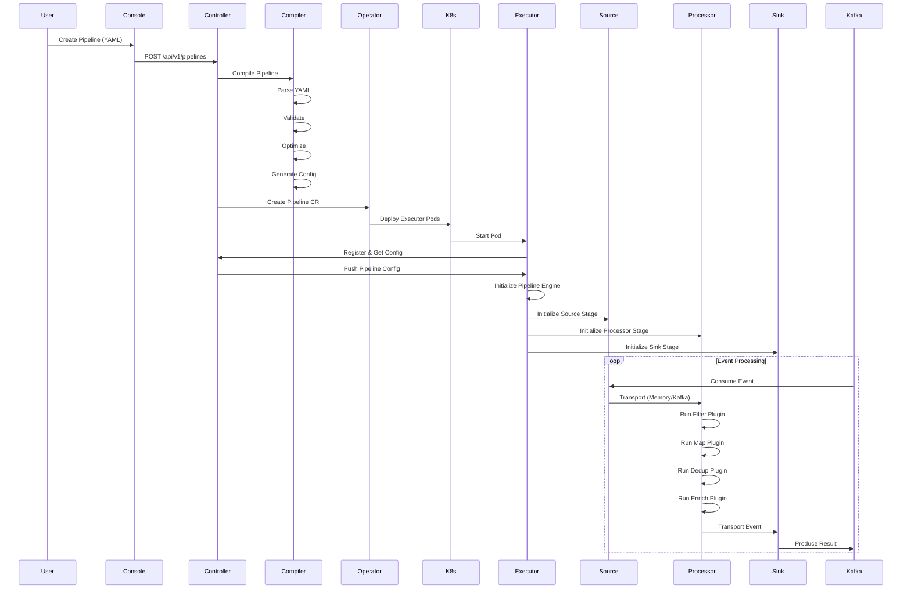
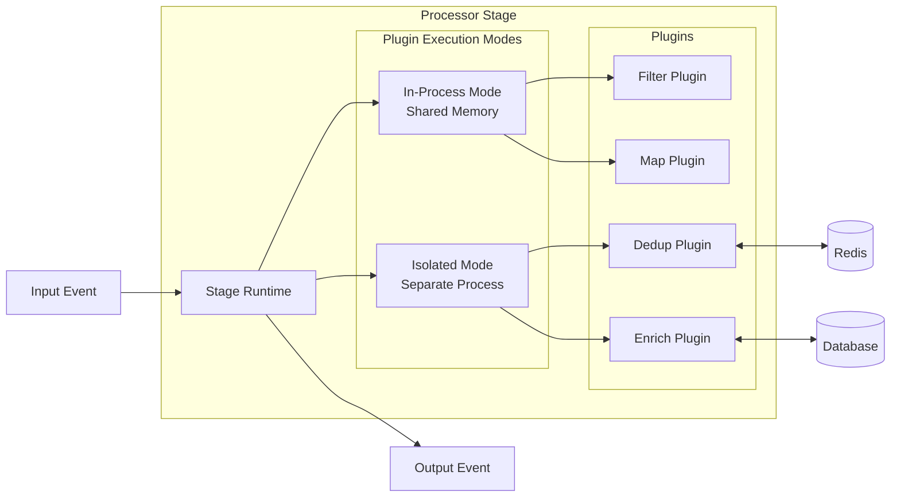
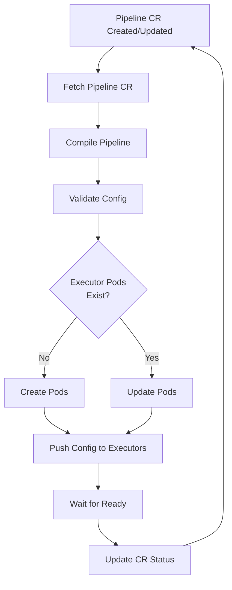

# YeTi: Real-Time ETL (Streaming ETL) Platform - Architecture Overview

## Введение

YeTi — это высокопроизводительная платформа для обработки потоковых данных в реальном времени, разработанная для выполнения операций ETL (Extract, Transform, Load) над непрерывными потоками событий. Платформа обеспечивает гибкую обработку данных через декларативные пайплайны с возможностью динамической реконфигурации без простоя и расширяемую плагинную архитектуру.

## Ключевые принципы проектирования

### 1. Масштабируемость и Производительность
- **Pipeline Executor на C++**: высокопроизводительный движок с поддержкой multi-threading
- **Плагинная архитектура процессоров**: гибкое добавление логики обработки
- **Гибридная изоляция плагинов**: выбор между in-process (скорость) и isolated (безопасность)
- **Горизонтальное масштабирование**: нативная поддержка Kubernetes с Operator

### 2. Гибкость и Расширяемость
- **Декларативный DSL на YAML**: простое определение пайплайнов
- **Plugin Marketplace**: экосистема готовых и пользовательских плагинов
- **Модульная архитектура**: чистое разделение data plane и control plane
- **SDK для разработки**: C++/Go/Python SDK для создания кастомных компонентов

### 3. Надежность и Отказоустойчивость
- **Zero-downtime deployment**: обновления через Kubernetes Rolling Updates
- **Hot reload конфигураций**: применение правил < 1 минуты без рестарта
- **Exactly-once семантика**: гарантированная доставка через транзакции
- **Pluggable transport**: выбор транспорта между stages (memory/kafka/grpc)

### 4. Cloud-Native подход
- **Kubernetes Operator**: декларативное управление через CRDs
- **GitOps ready**: управление конфигурациями через Git
- **Auto-scaling**: HPA на основе кастомных метрик
- **Multi-tenancy**: изоляция пайплайнов разных пользователей

### 5. Наблюдаемость
- **OpenTelemetry**: единый стандарт инструментирования
- **Распределенная трассировка**: полная видимость пути данных
- **Метрики в реальном времени**: мониторинг всех аспектов системы
- **Централизованное логирование**: структурированные логи с корреляцией

## Архитектурная диаграмма высокого уровня

```mermaid
graph TB
    subgraph "Data Sources"
        DS1[IoT Devices]
        DS2[Applications]
        DS3[CDC Streams]
        DS4[APIs]
    end
    
    subgraph "Ingestion"
        KB_IN[Message Broker<br/>Kafka/Kinesis/Pulsar]
        DS1 --> KB_IN
        DS2 --> KB_IN
        DS3 --> KB_IN
        DS4 --> KB_IN
    end
    
    subgraph "YeTi Platform"
        subgraph "Control Plane"
            UI[Web Console]
            CLI[CLI Tool]
            
            subgraph "Controller"
                CTRL[YeTi Controller]
                COMPILER[Pipeline Compiler]
                REGISTRY[Stage & Plugin Registry]
                PM[Plugin Manager]
            end
            
            CONFDB[(PostgreSQL<br/>Config Store)]
            
            UI --> CTRL
            CLI --> CTRL
            CTRL --> COMPILER
            CTRL --> REGISTRY
            CTRL --> PM
            CTRL --> CONFDB
        end
        
        subgraph "Data Plane"
            subgraph "Pipeline Executors"
                PE1[Executor Pod 1]
                PE2[Executor Pod 2]
                PE3[Executor Pod N]
            end
            
            subgraph "Pipeline Executor Internals"
                ENGINE[Pipeline Engine]
                
                subgraph "Stages"
                    SOURCE[Source Stage<br/>Kafka/HTTP/...]
                    PROC1[Processor Stage<br/>Plugins: Filter+Map]
                    PROC2[Processor Stage<br/>Plugins: Dedup+Enrich]
                    SINK[Sink Stage<br/>Kafka/S3/...]
                end
                
                TRANSPORT[Transport Layer<br/>Memory/Kafka/gRPC]
                
                ENGINE --> SOURCE
                SOURCE --> TRANSPORT
                TRANSPORT --> PROC1
                PROC1 --> TRANSPORT
                TRANSPORT --> PROC2
                PROC2 --> TRANSPORT
                TRANSPORT --> SINK
            end
            
            subgraph "Stage Storage"
                REDIS[(Redis<br/>Dedup Cache)]
                ENRDB[(PostgreSQL<br/>Enrichment DB)]
            end
            
            KB_IN --> PE1
            KB_IN --> PE2
            KB_IN --> PE3
            
            PROC2 <--> REDIS
            PROC2 <--> ENRDB
            
            CTRL -.gRPC<br/>Config Push.-> PE1
            CTRL -.gRPC<br/>Config Push.-> PE2
            CTRL -.gRPC<br/>Config Push.-> PE3
        end
        
        subgraph "Observability Stack"
            OTEL[OTel Collector]
            PROM[Prometheus]
            GRAF[Grafana]
            LOKI[Loki]
            TEMPO[Tempo]
            
            PE1 --> OTEL
            PE2 --> OTEL
            PE3 --> OTEL
            CTRL --> OTEL
            
            OTEL --> PROM
            OTEL --> LOKI
            OTEL --> TEMPO
            
            PROM --> GRAF
            LOKI --> GRAF
            TEMPO --> GRAF
        end
        
        subgraph "Kubernetes Operator"
            OPER[YeTi Operator]
            CRD[Pipeline CRDs]
            
            OPER --> CRD
            OPER --> CTRL
        end
    end
    
    subgraph "Output Layer"
        KB_OUT[Message Broker]
        DW[Data Warehouse]
        LAKE[Data Lake S3]
        STREAM[Stream Analytics]
        
        SINK --> KB_OUT
        SINK --> DW
        SINK --> LAKE
        KB_OUT --> STREAM
    end
    
    style ENGINE fill:#ff9999
    style COMPILER fill:#99ccff
    style REGISTRY fill:#99ccff
    style OPER fill:#99ff99
    style KB_IN fill:#ffcc99
    style KB_OUT fill:#ffcc99
```



## Основные компоненты

### Control Plane

#### 1. YeTi Controller (Go)
Центральный компонент управления платформой:
- REST/gRPC API для управления пайплайнами
- Интеграция с Kubernetes Operator
- Распределение конфигураций на Executor'ы
- Мониторинг состояния системы

#### 2. Pipeline Compiler
Компиляция YAML DSL в исполняемую конфигурацию:
- **Parser**: YAML → AST
- **Validator**: семантическая валидация
- **Optimizer**: оптимизация pipeline (stage fusion, elimination)
- **Codegen**: генерация runtime конфигурации

#### 3. Stage & Plugin Registry
Централизованный каталог компонентов:
- Регистрация доступных stage types
- Управление версиями плагинов
- Метаданные и схемы конфигурации
- Dependency resolution

#### 4. Plugin Manager
Управление жизненным циклом плагинов:
- Установка и обновление плагинов
- Валидация совместимости
- Plugin marketplace integration
- Sandboxing и безопасность

### Data Plane

#### 5. Pipeline Executor (C++)
Высокопроизводительный движок выполнения:
- **Pipeline Engine**: оркестрация выполнения stages
- **Stage Runtime**: окружение для запуска stages
- **Coordinator**: координация multi-stage pipelines
- **Transport Manager**: управление транспортом между stages

#### 6. Stage Types

**Source Stages (I/O Sources)**
- Kafka Consumer
- Kinesis Consumer
- RabbitMQ Consumer
- HTTP/WebSocket Server
- File Watcher

**Processor Stages (с плагинами)**
- **Filter Plugin**: условная фильтрация
- **Map Plugin**: трансформация данных
- **Dedup Plugin**: дедупликация
- **Enrich Plugin**: обогащение из внешних источников
- **Validate Plugin**: валидация схем
- **Aggregate Plugin**: агрегация и windowing
- **Router Plugin**: маршрутизация по условиям

**Sink Stages (I/O Sinks)**
- Kafka Producer
- S3 Writer
- ClickHouse Inserter
- Elasticsearch Indexer
- HTTP Client

#### 7. Transport Layer
Гибкий транспорт между stages:
- **Memory**: shared memory для in-process (минимальная latency)
- **Kafka**: durable transport для распределенных stages
- **gRPC**: streaming для cross-pod communication

### Infrastructure

#### 8. Kubernetes Operator
Native Kubernetes integration:
- Custom Resource Definitions (CRDs)
- Automated reconciliation
- Lifecycle management
- GitOps support

### User Interfaces

#### 9. Web Console (React/TypeScript)
- Visual Pipeline Builder с drag-and-drop
- YAML редактор с validation
- Monitoring dashboards
- Plugin marketplace browser

#### 10. CLI Tool (Go)
- Pipeline CRUD операции
- Plugin management
- Debugging и troubleshooting
- CI/CD integration

#### 11. SDKs
- **C++ SDK**: разработка stages и processor plugins
- **Go SDK**: клиентская библиотека и control plane extensions
- **Python SDK**: analytics и data science use cases

## Поток обработки данных



## Плагинная архитектура Processor



### Режимы изоляции плагинов

**In-Process Mode** (для производительности):
- Все плагины в одном процессе
- Минимальный overhead
- Общая память
- Использовать для: Filter, Map, Router

**Isolated Mode** (для безопасности):
- Каждый плагин в отдельном процессе/контейнере
- Изоляция памяти и ресурсов
- Защита от крашей
- Использовать для: Dedup, Enrich, пользовательские плагины

## Pipeline Compiler - Оптимизации

### Stage Fusion
Объединение нескольких stages в один для производительности:

```yaml
# До оптимизации
stages:
  - type: processor
    plugins: [filter]
  - type: processor
    plugins: [map]
  - type: processor
    plugins: [validate]

# После оптимизации (compiler)
stages:
  - type: processor
    plugins: [filter, map, validate]  # Объединено!
    isolation: thread
```

### Dead Code Elimination
Удаление неиспользуемых stages:

```yaml
# Если filter отклоняет 100% событий
stages:
  - type: processor
    plugins: [filter]
    config:
      condition: "false"  # Всегда false
  - type: processor       # ← Будет удален compiler'ом
    plugins: [enrich]
```

### Transport Optimization
Выбор оптимального транспорта:

```yaml
# Compiler автоматически выбирает:
# - memory: если stages в одном Pod
# - grpc: если stages в разных Pods одного региона
# - kafka: если нужна durability или cross-region
```

## Kubernetes Operator Integration

### Custom Resource Definitions

```yaml
apiVersion: yeti.io/v1
kind: Pipeline
metadata:
  name: user-events-pipeline
  namespace: production
spec:
  source:
    type: kafka
    config:
      topics: [user-events]
      
  stages:
    - name: filter-validate
      type: processor
      isolation: thread
      plugins:
        - filter
        - validate
        
    - name: enrich-dedupe
      type: processor
      isolation: process
      plugins:
        - dedup
        - enrich
        
  sink:
    type: kafka
    config:
      topic: processed-events
      
  scaling:
    minReplicas: 3
    maxReplicas: 20
    targetCPU: 70
    
  observability:
    metricsEnabled: true
    tracingEnabled: true
    logLevel: info
```

### Operator Reconciliation Loop



## Технологический стек

### Языки и фреймворки
- **C++20**: Pipeline Executor, Stages, Plugins
- **Go 1.21+**: Controller, Operator, CLI
- **TypeScript/React**: Web Console
- **Python 3.11+**: SDK для аналитики

### Infrastructure
- **Kubernetes 1.28+**: оркестрация
- **Kafka/Pulsar**: message broker
- **PostgreSQL 15**: конфигурация, метаданные
- **Redis 7**: кэширование, дедупликация

### Build & Deploy
- **Bazel 7+**: монорепо сборка
- **Docker**: контейнеризация
- **Helm**: package management
- **ArgoCD/Flux**: GitOps

### Observability
- **OpenTelemetry**: инструментирование
- **Prometheus**: метрики
- **Grafana**: визуализация
- **Loki**: логи
- **Tempo**: трассировка

## Структура монорепо

```
yeti-platform/
├── yeti/
│   ├── dataplane/              # Data Plane компоненты
│   │   ├── executor/           # Pipeline Executor
│   │   ├── stages/             # Stage имплементации
│   │   ├── transport/          # Transport layer
│   │   └── common/             # Общие библиотеки
│   ├── controlplane/           # Control Plane компоненты
│   │   ├── controller/         # Main controller
│   │   ├── compiler/           # Pipeline compiler
│   │   ├── registry/           # Stage & plugin registry
│   │   └── plugin-manager/     # Plugin management
│   ├── operator/               # Kubernetes Operator
│   ├── api/                    # API Gateway
│   ├── ui/                     # Web Console
│   ├── cli/                    # CLI Tool
│   └── sdk/                    # SDKs (C++/Go/Python)
├── deploy/                     # Deployment configs
├── docs/                       # Документация
└── third_party/                # Внешние зависимости
```

## Ключевые преимущества архитектуры

1. **Производительность**: C++ executor + plugin fusion = > 100K events/sec
2. **Гибкость**: плагинная архитектура + SDK для расширения
3. **Надежность**: exactly-once semantics + fault tolerance
4. **Масштабируемость**: horizontal scaling + auto-scaling
5. **Cloud-Native**: Kubernetes operator + GitOps
6. **Observability**: OpenTelemetry + полная трассировка
7. **Developer Experience**: декларативный DSL + visual editor + marketplace

## Следующие шаги

Для детального понимания см.:
- [Компоненты](components.md) - подробное описание каждого компонента
- [Data Flow](data-flow.md) - детальный поток данных
- [DSL Specification](../dsl/pipeline-schema.md) - спецификация YAML DSL
- [API Documentation](../api/) - API спецификации
- [Deployment Guide](../deployment/kubernetes/overview.md) - руководство по развертыванию
- [Plugin Development](../sdk/) - разработка плагинов
